# Cubie A7Z case

A two-piece snap-fit case for the
[Radxa Cubie A7Z](https://radxa.com/products/cubie/a7z/). The board drops
into a tray, a lid clicks on top. No screws, no supports, no glue.

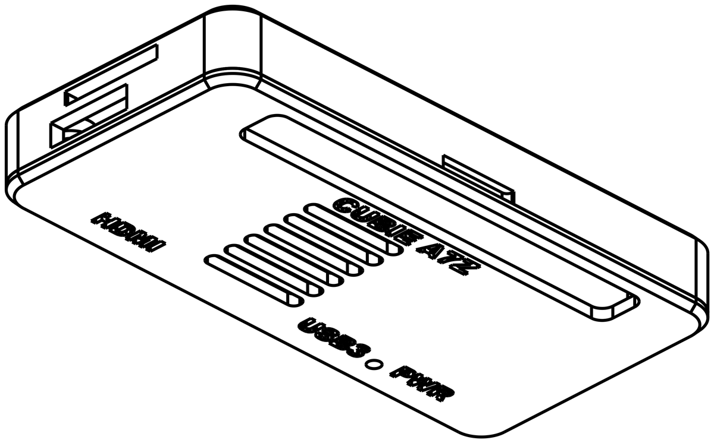

## Print two parts

Everything ready to print is in [`output/`](output/). Take one tray and one
lid — any pairing works.

### Tray

|  |  |
|---|---|
| 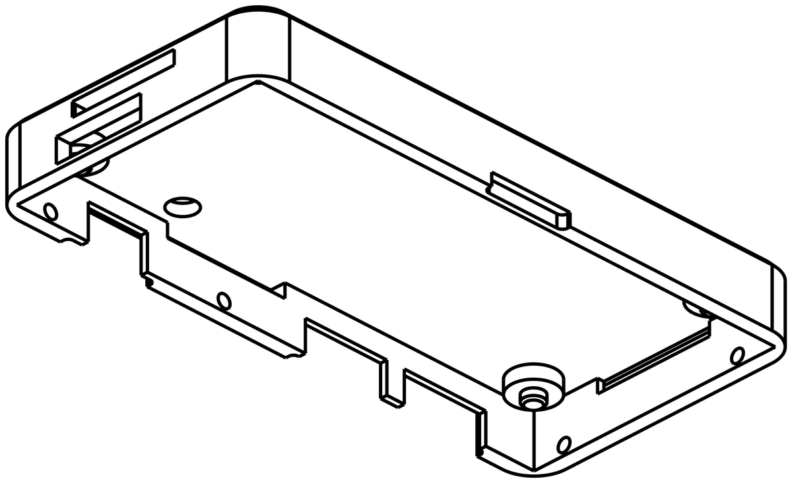 | 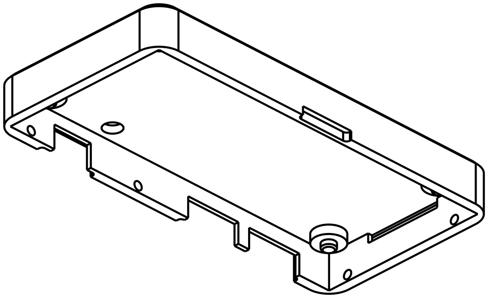 |
| **`bottom.stl`** — openings for the PCIe ribbon, a CSI camera, the WiFi antenna and a fan. | **`bottom-sealed.stl`** — none of those openings, for a cleaner box. |

Every tray keeps the ports, the microSD slot and the boot button reachable.

### Lid

|  |  |  |
|---|---|---|
| 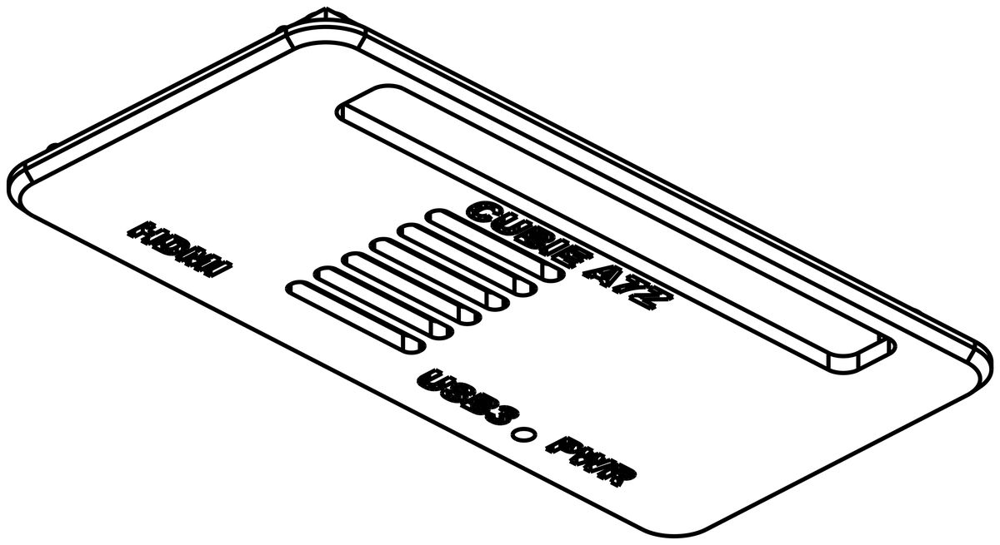 | 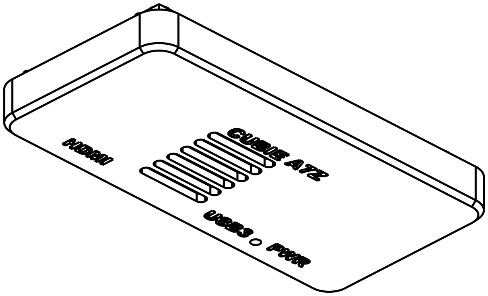 | 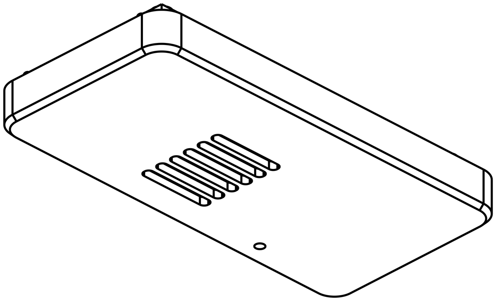 |
| **`lid.stl`** — the 40-pin header pokes through, ready for jumper wires and female headers. | **`lid-closed.stl`** — covers the header, 5 mm taller. | **`lid-closed-plain.stl`** — the same lid with no engraving. |

The case is 34 × 69 mm, and **9.1 mm** tall with the open lid or 14.2 mm
with a closed one.

### Or go slim

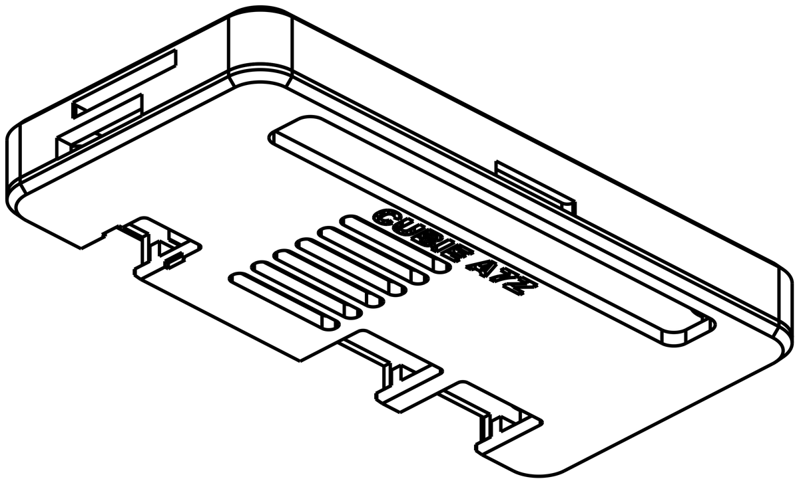

If you're not running a fan, there's a shorter pair that drops the case to
**7.8 mm** — `bottom-slim.stl` (or `bottom-slim-sealed.stl`) with
`lid-slim.stl`.

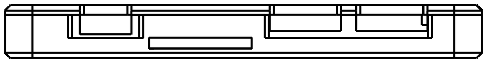

The cavity is cut down to just clear the tallest chip on the board, which
leaves no room to route a fan lead. It also puts the lid below the USB-C
shells, so the port openings carry on up through the lid and open at the
top edge rather than being closed off by it — you can see the difference
against the standard case above. Slim parts only fit each other, not the
standard ones.

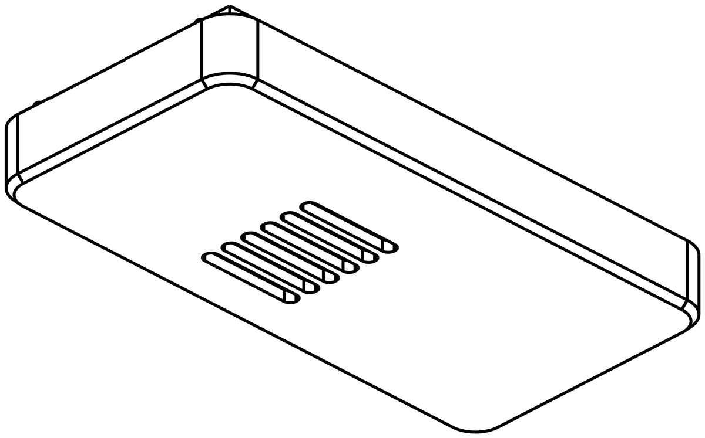

`lid-slim-closed-plain.stl` is the other lid for a slim tray: no GPIO
opening, no engraving, nothing on top but the vents. Covering the 40-pin
header is what sets its height, so the case comes out at 14.2 mm — the same
as the standard closed lid, and no shorter for being slim underneath.

No slim lid has the status-LED pinhole. It would have to be drilled through
the 0.95 mm fin left standing between the two USB-C openings, which on a
slim lid run right through the slab.

## Settings

Any material works; pick PETG or ABS if the board will run warm.

- **0.2 mm layers, no supports, no brim.**
- Print the tray cavity-up and the lids exactly as they're exported — they
  are already flipped flat-side-down.

## Put it together

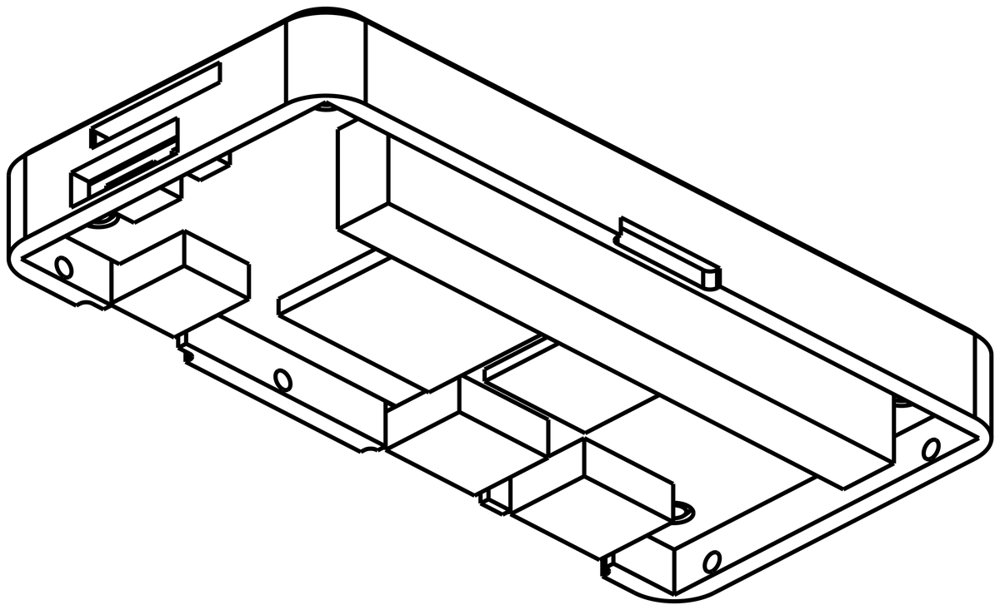

1. **Drop the board in**, ports facing the notched wall. Four pins catch
   its mounting holes, so it only fits one way round.
2. **Press the lid on.** Six ribs click into the tray and hold the board
   down against its standoffs.

To open it again, push up through the notch in the middle of the long
plain wall.

## Using it

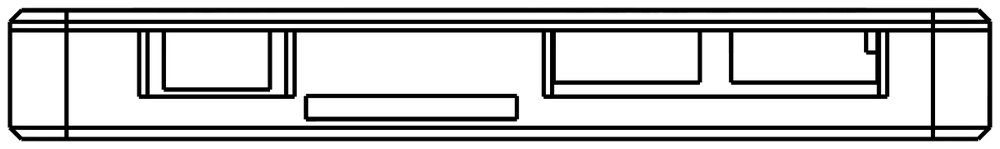

Micro HDMI, USB-C 3.1 with DisplayPort, and USB-C power, left to right,
each labelled on the lid. The openings are recessed so a chunky cable
overmold still seats fully. The thin slot in the middle is where a PCIe
ribbon leaves the case. The pinhole between the two USB-C ports is the
status LED (standard lids only).

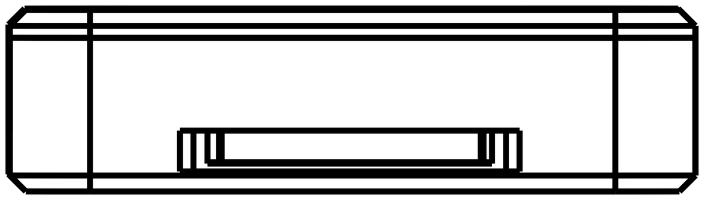

**microSD** goes in the end of the case nearest the power port, low in the
wall. A seated card ends up level with the outside face, so the wall around
the slot is scalloped back — that leaves an edge to pinch when you want the
card out again.

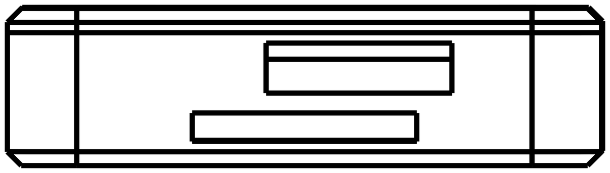

The **other end** is where cables leave the full tray: the antenna pigtail
and fan lead through the upper slot, a MIPI CSI camera ribbon through the
lower one. The sealed tray has neither.

**USB BOOT**: hold a paperclip in the marked hole underneath — it's at the
HDMI end, behind the HDMI port — while you plug power in, and the board
comes up in flashing mode.

**Cooling**: the vents sit directly over the processor, and the full tray
passes a fan cable out the end.

## Two-colour text (optional)

If you have a multi-material printer, each engraved lid ships with a
matching inlay — `lid-inlay.stl` and `lid-closed-inlay.stl`. Load the lid,
add the inlay to it as a second *part* of the same object, colour it, and
print. The letters come out flush with the surface.

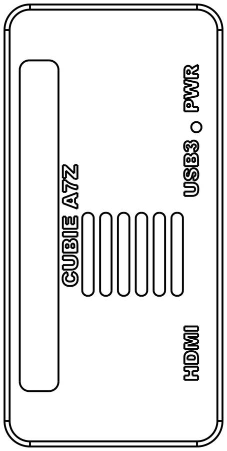

## Building it yourself

The case is generated from a parametric
[CadQuery](https://github.com/cadquery/cadquery) model, dimensioned from
Radxa's published mechanical drawings and board STEP:

```sh
uv run case.py          # rebuild output/
uv run render_images.py # rebuild the images above
```

`case.py` rebuilds the board from the vendor STEP and checks every part
against it — fit, drop-in clearance, snap engagement, printability — and
refuses to export if anything is off. How it's dimensioned and why the
geometry is shaped this way is in [docs/DESIGN.md](docs/DESIGN.md).
